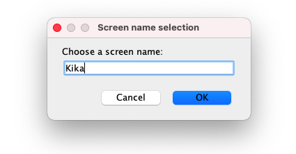
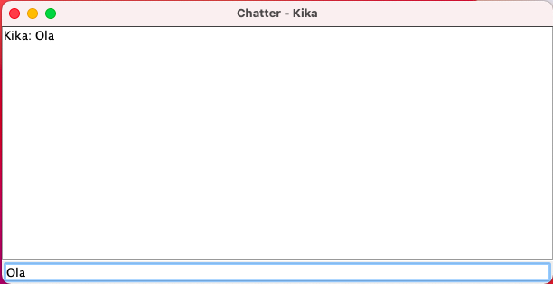

# CA2-Part1

## Introduction

The goal of this class assignment is to employ Git and Gradle tools to streamline software project workflows, 
focusing on version control and build automation.
This tutorial will have the following structure:
1. [Part 1](#1part-i)

   1.1. [Copy the code of the gradle_basic_demo into a new folder named Part 1 of CA2](#11-copy-the-code-of-the-gradlebasicdemo-into-a-new-folder-named-part1-of-ca2)

   1.2. [Read the instructions available in the `readme.md` file and experiment with the application](#12-read-the-instructions-available-in-the-readmemd-file-and-experiment-with-the-application)

   1.3. [Add a new task to execute the server](#13-add-a-new-task-to-execute-the-server)

   1.4. [Add a simple unit test and update the gradle script so that it is able to execute the test](#14-add-a-simple-unit-test-and-update-the-gradle-script-so-that-it-is-able-to-execute-the-test)

   1.5. [Add a new task of type Copy to be used to make a backup of the sources of the application](#15-add-a-new-task-of-type-copy-to-be-used-to-make-a-backup-of-the-sources-of-the-application)

   1.6. [Add a new task of type Zip to be used to make an archive (i.e., zip file) of the sources of the application](#16-add-a-new-task-of-type-zip-to-be-used-to-make-an-archive-ie-zip-file-of-the-sources-of-the-application)

   1.7. [At the end of Part 1 of this assignment mark your repository with the tag ca2-part1](#17-at-the-end-of-the-part-1-of-this-assignment-mark-your-repository-with-the-tag-ca2-part1)

2. [Conclusion](#2conclusion)

## 1.Part I

This tutorial segment guides us through the practical steps of enhancing a software project using Git for version 
control and Gradle for build automation. Beginning with cloning an existing demo from a repository, we proceed to 
restructure our project's version history and organize it into a new directory. We'll commit our modifications to Git, 
demonstrating how to effectively manage changes and use tagging to mark milestones. Alongside, Gradle's utility will be 
harnessed for tasks like building the project, running a server, conducting unit tests, and ensuring the integrity of 
our application through automated processes. This hands-on approach aims to provide a comprehensive understanding of 
leveraging Git and Gradle for sophisticated project management and development practices.

### 1.1. Copy the code of the gradle_basic_demo into a new folder named Part1 of CA2

First you need to save the project into a local repository with the following command:

```
git  clone  https://bitbucket.org/pssmatos/gradle_basic_demo.git
```

Now you will need to delete the references to Git repository  and your own local repository.

```
cd  gradle_basic_demo 
rm  -rf  .git
```

Go to your GitHub repository with the command below

```
cd  repositorio
```

Use the following command to create a new directory named `CA2/Part1` in the current location on your system.
This command will create a folder `Part1` inside your new `CA2` folder

```
mkdir  -p  CA2/Part1
```

Now you can copy all contents from the `gradle_basic_demo` directory to the `CA2/Part1` directory, preserving the 
original files' attributes and structure, with the command:
(First you need to go into your `gradle_basic_demo` directory using the `cd`command below)
```
cd  gradle_basic_demo
```

```
cp  -a  .  <path_for_repository>
```

After this you are ready to commit and push it to your GitHub repository. To do it you need to execute the following commands.
Remember that you need to go into your local repository first.
The `close #3` is used to close the issue (number #3) that was already created in GitHub.

```
cd  repositorio

git  add  .

git  commit  -m  "close #3 added example application gradle_basic_demo"

git  push
```

### 1.2. Read the instructions available in the `readme.md` file and experiment with the application

Before starting the instructions you need to go into Part1. Use the following command:

```
cd  CA2/Part1
```

When you execute the command `./gradlew  build` your terminal should look like in the image below:


For the next step we used the port 59001, executing the command
`java  -cp  build/libs/basic_demo-0.1.0.jar  basic_demo.ChatServerApp  59001`.


When you execute the command `./gradlew  runClient` in a different terminal, it should look like the following image:


After this a new window opens and you have to write your username.



Now you are ready to use the chat like below:




### 1.3. Add a new task to execute the server

You need to go to the `build.gradle` file and add a new task like in the example below:

```
task runServer(type:JavaExec, dependsOn: classes){
    group = "DevOps"
    description = "Launches a chat server that listens on port 59001"

    classpath = sourceSets.main.runtimeClasspath

    mainClass = 'basic_demo.ChatServerApp'

    args '59001'
}
```

After you add the task you are ready to run it, using the following command:

````
./gradlew runServer
````


Now you can commit and push your task with the related issue:

```
cd repositorio

git add .

git commit -m "close #4 new task to execute the server"

git push
``` 

### 1.4. Add a simple unit test and update the gradle script so that it is able to execute the test

First you need to create a folder to your test. After this you should add the following dependency into `build.gradle` .

```
testImplementation  group:  'junit',  name:  'junit',  version:  '4.12'
```

Now add the test below to the class AppTest.java.

```
package  basic_demo;
import  org.junit.Test;
import  static  org.junit.Assert.*;

public  class  AppTest  {

	@Test
	public  void  testAppHasAGreeting() {
		App  classUnderTest  =  new  App();
		assertNotNull("app should have a greeting",  classUnderTest.getGreeting());
	}
}
```

To run the test execute the command:

```
./gradlew test
```


You can commit and push as before:

```
git add .

git commit -m "close #5 added a simple unit test and update the gradle script"

git push
```

### 1.5. Add a new task of type Copy to be used to make a backup of the sources of the application

You need to go to the `build.gradle` file and add a new task like in the example below:

```
task  createBackup(type: Copy,  dependsOn:  classes) {
	from  'src'
	into  'build/backup'
}
```

After you add the task you are ready to run it, using the following command:

````
./gradlew createBackup
````


Now you can commit and push your task with the related issue:

```
cd repositorio

git add .

git commit -m "close #6 added a task to copy the source code to a backup directory"

git push
``` 

### 1.6. Add a new task of type Zip to be used to make an archive (i.e., zip file) of the sources of the application

You need to go to the `build.gradle` file and add a new task like in the example below:

```
task zip(type: Zip, dependsOn: classes) {
	from 'src'
	archiveFileName = 'backup.zip'
	destinationDir(file('build'))
}
```

After you add the task you are ready to run it, using the following command:

````
./gradlew zip
````


Now you can commit and push your task with the related issue:

```
cd repositorio

git add .

git commit -m "close #7 added a task to create a zip file with the source code"

git push
``` 

### 1.7. At the end of the part 1 of this assignment mark your repository with the tag ca2-part1

Use the following command to create a new tag.

```
git tag ca2-part1 
```

Run the command below to push the tag into your remote repository.

```
git push origin ca2-part1 
```

## 2.Conclusion

This tutorial emphasized the importance of using Git for version control and Gradle for automation, making software 
projects more efficient and manageable. By working through practical examples, it showed how to streamline development 
workflows and ensure code is easily updated and tested. This guide provided a foundation for better project management 
and effective collaboration in software development.
