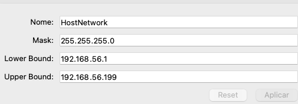
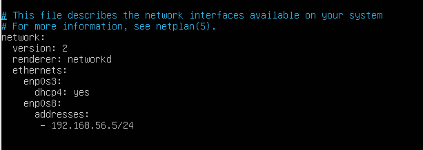
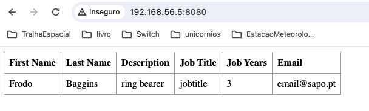

# CA3-Part1

## Introduction
The objective of the part I of this project is to improve skills in using VirtualBox, integrating projects from previous work in a VirtualBox virtual environment running Ubuntu.

This tutorial will have the following structure:
1. [Part I](#1part-i)

    1.1. [Start by creating your VM as described in the lecture](#11-start-by-creating-your-vm-as-described-in-the-lecture)

    1.1.1. [Create a new VM and change your VM settings as below:](#111-create-a-new-vm-and-change-your-vm-settings-as-below)

    1.1.2. [To create a host-only network follow the steps:](#112-to-create-a-host-only-network-follow-the-steps)

    1.1.3. [After starting the VM, log on into the VM and continue the setup:](#113-after-starting-the-vm-log-on-into-the-vm-and-continue-the-setup)

    1.2. [Clone your individual repository inside the VM](#12-clone-your-individual-repository-inside-the-vm)

    1.3. 1.4. [Build and execute the spring boot tutorial basic project and the gradle_basic_demo project](#13-14-build-and-execute-the-spring-boot-tutorial-basic-project-and-the-gradlebasicdemo-project)

    1.5. [For projects such as the simple chat application you should execute the server inside the VM and the clients in your host machine. Why is this required?](#15-for-projects-such-as-the-simple-chat-application-you-should-execute-the-server-inside-the-vm-and-the-clients-in-your-host-machine-why-is-this-required)
2. [Conclusion](#2conclusion)

## 1.Part I

### 1.1. Start by creating your VM as described in the lecture

#### 1.1.1. Create a new VM and change your VM settings as below:

- Connect image (ISO) with the Ubuntu 18.04 minimal installation media: https: //help.ubuntu.com/community/ Installation/MinimalCD
- The VM needs 2048 MB RAM
- Set Network Adapter 1 as Nat
- Set Network Adapter 2 as Host-only Adapter (vboxnet0)

Start the VM and install Ubuntu

#### 1.1.2. To create a host-only network follow the steps:

- Click on Tools -> Host only networks -> Create
- Fill as in the following image:



#### 1.1.3. After starting the VM, log on into the VM and continue the setup:

To update the packages repositories use the command:

```
sudo apt update
```

Install the network tools with the following command.

```
sudo apt install net-tools
```

To edit the network configuration file to set up the IP use the command below:

```
sudo nano /etc/netplan/01-netcfg.yaml
```

Your file's contents should correspond to the following:



Use the command ```sudo netplan apply``` to apply the changes.


Now you can set up the openssh-server to facilitate secure SSH connections to the virtual machine from different hosts. To do it, use the command:

```
sudo apt install openssh-server
```

To enable password authentication for ssh go into your configuration file using the command ```sudo nano /etc/ssh/sshd_config``` and uncomment the line PasswordAuthentication yes

Now run the command ```sudo service ssh restart``` to restart the ssh server.

You should now be able to use ssh from your computer to your VM.

Use the commands below to install git and java 8. 

```
sudo apt install git
sudo apt install openjdk-8-jdk-headless
```

### 1.2. Clone your individual repository inside the VM

First you need to login via ssh in your terminal with the following command:

```
ssh <username>@192.168.56.5
```


Now you need to generate a public key in your VM to access to git with the command:

```
ssh-keygen -t ed25519 -C "1231829@isep.ipp.pt"
```

To see your public key use the command:

```
nano /home/kika/.ssh/id_ed25519.pub
```

Now you need to copy all the content of that file.
On GitHub, go to the account settings and add a new SSH key as in the images below.


Go to GitHub as shown in the screenshot to retrieve the URL of the repository to clone.


To clone the Git repository to the virtual machine, use the following command:

```
git clone git@github.com:FranciscaNogueira/devops-23-24-JPE-PSM-1231829.git
```


### 1.3. 1.4. Build and execute the spring boot tutorial basic project and the gradle_basic_demo project

Install the dependencies of the projects(maven and gradle) with the commands below .

```
sudo apt install maven
```

```
sudo apt install gradle
```

#### CA1

To execute CA1, first you need to go into your basic folder with the command:

```
cd devops-23-24-JPE-PSM-1231829/CA1/basic/
```

Execute the project using the command below.

```
mvnw spring-boot:run
```

Now your application should be running. Open the URL of your virtual machine where the application is exposed in the computer's browser.


#### CA2 Part I

Go to your CA2Part1 with the following command:

```
cd ~/devops-23-24-JPE-PSM-1231829/CA2/Part1
```

Use the command below to run the server.

```
./gradlew runServer
```

Now your server in VM is listening. Is time to run the client   
in a terminal on your computer with the command ```./gradlew runClient```. You will find that the chat closes because it encounters an error when trying to connect to localhost (As in the image below).


In CA2 Part 1, it is only possible to run the chat server on the virtual machine. Since the client is currently configured to connect to localhost, it will not be able to connect to the server running on the VM.

To change the server IP, it will be necessary to modify the code in the ```build.gradle``` file (task runClient), as below:

```groovy
task runClient(type:JavaExec, dependsOn: classes){  
  group = "DevOps"  
  description = "Launches a chat client that connects to a server on 192.168.56.5:59001 "  
  classpath = sourceSets.main.runtimeClasspath  
  
 mainClass = 'basic_demo.ChatClientApp'  
  
  args '192.168.56.5', '59001'  
}
```

Use the command ```./gradlew build``` to compile your project.

Now you can run the server in your VM and the client in your local machine and the chat will work.

#### CA2 Part II

Change directory with the following command:

```
cd ~/devops-23-24-JPE-PSM-1231829/CA2/Part2/react-and-pring-data-rest-basic
```

Try to execute the application with the command ```./gradlew bootRun```.


As you can see it is not possible to execute the application because your VM is using java 8. and your project is expecting to be compiled with java 17.
Now you need to fix it by upgrading java version in your VM.
To do it, first update the repository index, executing the following command in the terminal:

```
sudo apt update
```

Next, install ```OpenJDK 17``` using the following command:

```
sudo apt install -y openjdk-17-jdk
```

To verify that you are using the expected version you can run the command ```java -version```.

Use the command ```./gradlew build``` to compile the project with java 17.

Now when you execute the command ```./gradlew bootRun``` you will be able to see the image below in your browser (using your VM IP with the port 8080).



### 1.5. For projects such as the simple chat application you should execute the server inside the VM and the clients in your host machine. Why is this required?

Because it's following a client - server architecture. This means the expected use for this kind of applications is to have a server for multiple clients.
By running the server inside a VM, we are replicating a production scenario, where server is running in a different machine of the client.


## 2.Conclusion

This practical work highlighted the integration of technological tools in virtual environments, using VirtualBox and Ubuntu to execute software projects. The importance of Git for effective management of source code and security of communications via SSH with remote repositories was demonstrated. Challenges were faced such as the configuration of virtual networks and software compatibility, which were overcome through technical adjustments and updates. 
