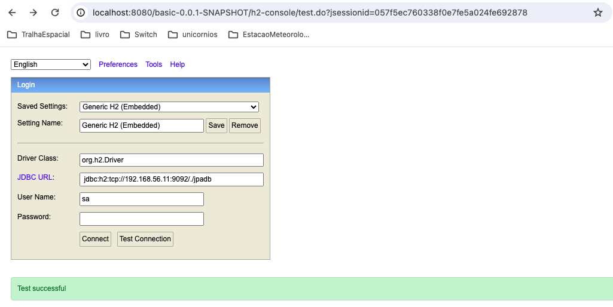
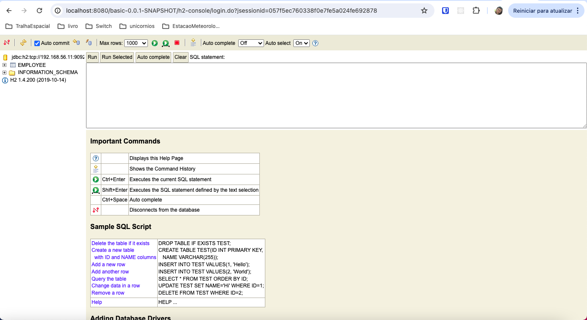
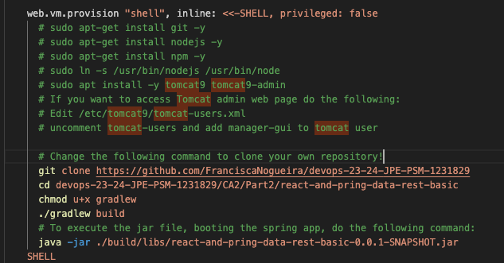
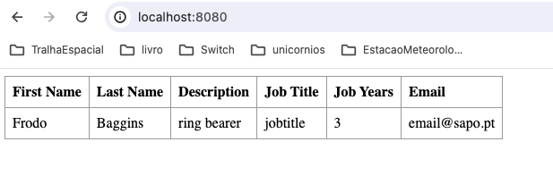
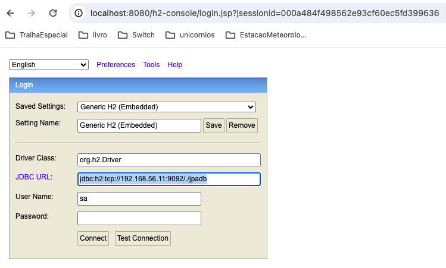
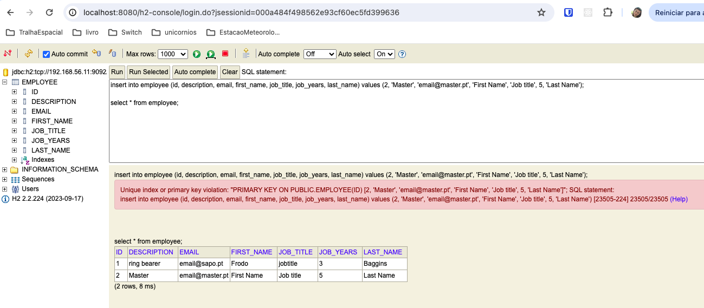
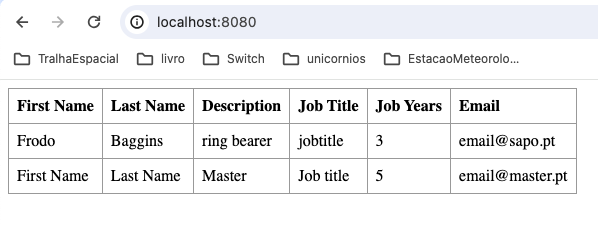
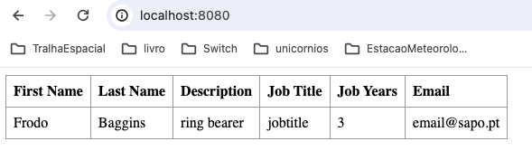
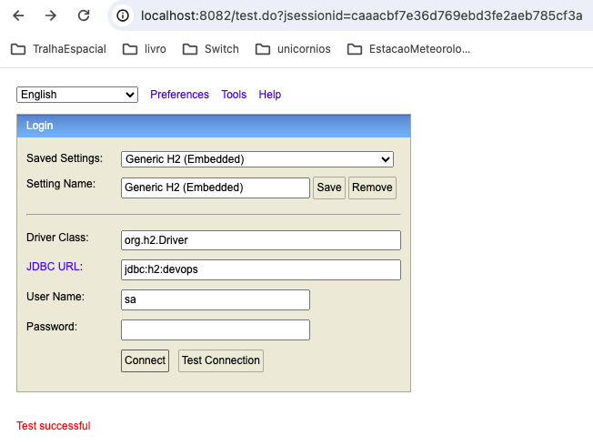

# CA3-Part2


## Introduction
The objective of Part II of this project is to improve skills in using Vagrant to manage development environments by configuring multiple virtual machines and integrating Spring Boot applications with an H2 database, as well as exploring alternative technological solutions for virtualization tools in different operational contexts.

This tutorial will have the following structure:
1. [Part II](#1part-ii)

   1.1. [Copy this Vagrantfile to your repository](#11copy-this-vagrantfile-to-your-repository)

   1.2. [Update the Vagrantfile configuration so that it uses your own gradle version of the spring application](#12update-the-vagrantfile-configuration-so-that-it-uses-your-own-gradle-version-of-the-spring-application)
   
    1.3. [Replicate the changes in your own version of the spring application](#13replicate-the-changes-in-your-own-version-of-the-spring-application)
2. [Alternative technological solution for the virtualization tool](#2alternative-technological-solution-for-the-virtualization-tool)

   2.1. [Docker implementation](#21docker-implementation)
3. [Bibliography](#3bibliography)
4. [Conclusion](#4conclusion)

## 1.Part II

### 1.1.Copy this Vagrantfile to your repository

First you need to go into your repository with the following command:

```
cd /Users/kika/Desktop/Switch/segundoSemestre/devOps/praticas/gitRepositorio/CA3
```

Create a new folder , where you will put the Vagrantfile, with the command:

```
mkdir Part2
```

Copy the Vagrantfile from the agrant-multi-spring-tut-demo project to your Part2 folder.
Now run the command ```vagrant up``` to create two vagrant VM (one for db and another for web).

Next, to see the application running, put in your browser:

http://localhost:8080/basic-0.0.1-SNAPSHOT/


To see your h2 console use the URL below.

http://localhost:8080/basic-0.0.1-SNAPSHOT/h2-console

Fill the field `JDBC URL:` with  ` jdbc:h2:tcp://192.168.56.11:9092/./jpadb` as in the following snapshot:



As you can see, if you press the `connect` button it is possible to connect with the data base and run queries.



### 1.2.Update the Vagrantfile configuration so that it uses your own gradle version of the spring application

First you need to make your github repository public.
After that, you should modify the Vagrantfile document to change the repository being cloned and the respective path to access the Gradle project (CA2 part2), as shown in the print below."



You can comment out the line that installs Tomcat 9 in the document, as its installation is not necessary for running the application. In the latest versions, Spring Boot already includes an embedded version of Tomcat, making it sufficient to execute the JAR file with the command `java -jar <file_name>.jar` to start the application.

Since Tomcat is no longer needed, we will recreate the virtual machines so that the "web" virtual machine does not have Tomcat installed and occupying port 8080, which will now be used by the Tomcat of the Spring Boot application.
To delete and recreate the virtual machines with the new configurations run the following command:

```
vagrant destroy && vagrant up
```

To open the application, use the URL http://localhost:8080/ in your browser.

You should be able to see something like in the next image.



### 1.3.Replicate the changes in your own version of the spring application

To update the `application.properties` file, to include the configurations for the application to connect to the H2 database on the "DB" VM, include the following command on Vagrantfile:

```properties
echo "
spring.data.rest.base-path=/api
#spring.datasource.url=jdbc:h2:mem:jpadb
# In the following settings the h2 file is created in /home/vagrant folder
spring.datasource.url=jdbc:h2:tcp://192.168.56.11:9092/./jpadb;DB_CLOSE_DELAY=-1;DB_CLOSE_ON_EXIT=FALSE
spring.datasource.driverClassName=org.h2.Driver
spring.datasource.username=sa
spring.datasource.password=
spring.jpa.database-platform=org.hibernate.dialect.H2Dialect
# So that spring will no drop de database on every execution.
spring.jpa.hibernate.ddl-auto=update
spring.h2.console.enabled=true
spring.h2.console.path=/h2-console
spring.h2.console.settings.web-allow-others=true
      " > src/main/resources/application.properties
```

You need to shutdown the VM with the command `vagrant halt web` so you can run the Vagrantfile updated when you initialize it again.
To initialize again your VM an run the new configurations, use the command below:

```
vagrant up --provision
```

If you want to confirm that the application has connected to the correct database, follow the next steps:

1. Open the h2 console, with the url http://localhost:8080/h2-console/
2. Configure the `JDBC URL` with `jdbc:h2:tcp://192.168.56.11:9092/./jpadb` ( corresponding to the DB VM) as in the image below:



3. Apply an insert query in the employee table as in the following image.



4. Verify that the application returns all the entries in the table, including the one you inserted manually, as shown in the image below:




## 2.Alternative technological solution for the virtualization tool

Vagrant ships with out of the box support for the hypervisors VirtualBox, Hyper-V and VMware. There's also support for Docker.

For the alternative technical solution, all options have been explored. However, given the hardware and software i have available, i had several difficulties in choosing one.

Available Hardware: Macbook Air early 2014
Operative system: MacOS Big Sur - 11.7.10 (not upgradable, given computer age)


- VirtualBox: solution already implemented in CA3;
- Hyper-V: is a Windows only hypervisor;
- VMware: Only supports MacOS > 12
- Docker: While latest versions only support higher MacOS versions, I found an older docker version that stills works with this computer.

Because of this, the only options available was docker. We must take in account that this is a containerization tool, not a VM hypervisor. I felt very limited in this CA implementation, given it's meant be used in a distinct way of a VM (even if both technologies serve some similar purposes).

### 2.1.Docker implementation

Docker is a containerization technology that does not isolate an entire operating system. Instead, it isolates the application level.

As in this CA most of the work is being done on Vagrantfile, which runs several commands inside the VMs to setup, and docker usually is meant to be using docker images, publishing them to a docker registry, and just run those images, it is complicated to do the things the same way as in a VM.
Because of it Tomcat install will be skipped and a docker image is used for H2 server.

To support docker with vagrant, you must install docker plugin with the following command:

```
vagrant plugin install vagrant-docker-compose
```

Create a new folder with the Vagrantfile file (you can find the file in this project in the Alternative folder) and set it up with the command below.

````
vagrant up --provider=docker
````

As you can see the application is working.




After several configuration tries, it was unable to setup a docker network through Vagrantfile. This means the web_container is using an H2 in memory database and not the db_container H2 server. This happens because without being in the same network web_container cannot reach db_container, so I decided to let the default application.properties database configurations.

## 3.Bibliography

https://developer.hashicorp.com/vagrant/docs/providers/docker

https://docs.docker.com/

https://hub.docker.com/r/buildo/h2database


## 4.Conclusion

This practical part highlighted the integration of technological tools in development environments, using Vagrant to configure multiple virtual machines and integrate Spring Boot applications with an H2 database. Challenges such as the configuration of virtual networks and software compatibility were faced and some were overcome through technical adjustments. Additionally, alternative solutions for virtualization tools were explored, considering different operational contexts and hardware and software limitations.