# CA4-Part1


## Introduction
This tutorial will have the following structure:
1. [Version 1](#1version-1)
2. [Version 2](#2version-2)

## 1.Version 1

First of all you need to access to your repository. To do it, use the following command:

```
cd /Users/kika/Desktop/Switch/segundoSemestre/devOps/praticas/gitRepositorio/
```

### 1.1. You should create a docker image (i.e., by using a Dockerfile) to execute the chat server

Create the necessary folder structure to include a package for version1.

```
mkdir -p /CA4/Part1/version1
```

Now go to the directory that you create before

```
cd ./CA4/Part1/version1/
```

Copy to this directory your project from CA2 part2

```
cp -r ../../../CA2/Part1/* .
```

To create a Dockerfile, use the command below:

```
touch Dockerfile
```

Now, open your Dockerfile in a text editor and write the following content:

```dockerfile

# syntax=docker/dockerfile:1

  

FROM openjdk:17-ea-jdk

COPY . /app

WORKDIR /app

CMD ./gradlew runServer

```

Explaining all the commands step by step:

FROM - To create the current image based on the existing openjdk:17-ea-jdk image, since Java 17 is already installed, necessary to run our application.

COPY - To copy the entire project (directory) on the computer to the /app directory inside the container.

WORKDIR - To change the working location inside the container to this directory. From here onwards all commands will be executed within this directory.

CMD - To specify the default program that will execute once the container runs. Only one can exist for each Dockerfile. In your scenario, this will build and run the chat server, using gradle.

Now build the docker image, in this case name it ca2_image_v1:

```
docker build -t ca2_image_v1 .
```

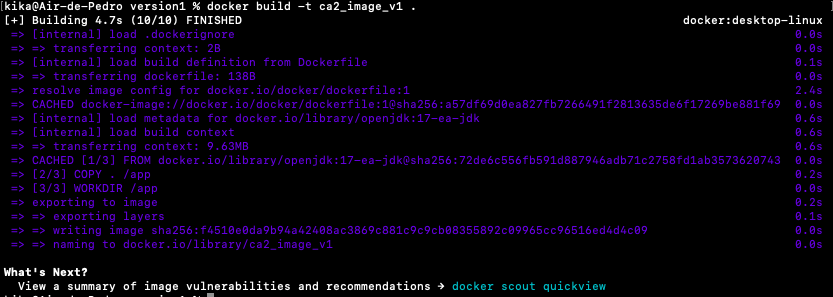

You can run the image using the following command:

```
docker run -p 59001:59001 -d ca2_image_v1
```

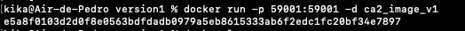

Now you can open another terminal, go to the CA4/Part1/version1 directory and run the client from your host computer. To do it, use the following commands:

```
cd Desktop/Switch/segundoSemestre/devOps/praticas/gitRepositorio/CA4/Part1/version1

./gradlew runClient
```

You should fill the username on the client interface.

You can see that the client connected correctly to the app running on the container, by looking at the docker container logs.
To see that, run the command below:

```
docker ps - to get the docker container id
```

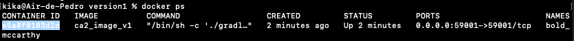

To look at the docker container logs you can use the command:

```
docker logs <container  id>
```

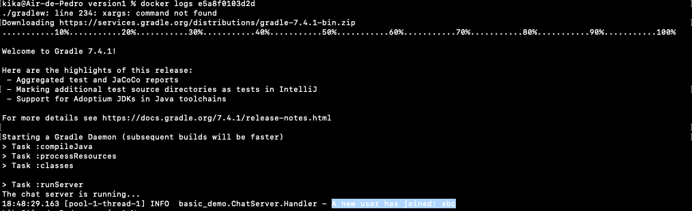

### 1.2. You should tag the image and publish it in docker hub

Now you know the image is working as expected, you're ready to tag and push the image to docker hub.
For that, create an account in docker hub.
Build and tag the image with the following command:

```
docker build -t 1231829/ca2_image_v1 .
```

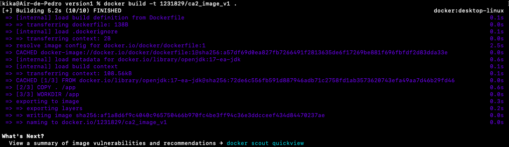

Once you have the image built and tagged, you're ready to push it to a docker hub registry. To do so, login to docker hub:

```
docker login -u 1231829@isep.ipp.pt
```

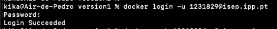

Now you can use the docker push command. as below:

```
docker push 1231829/ca2_image_v1
```

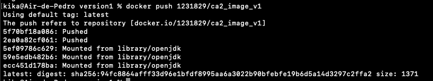

The image is now published to docker hub.

### 1.3. You should be able to execute the chat client in your host computer and connect to the chat server that is running in the container


To run the image that is published to docker hub, you can run the following command:

```
docker run -p 59001:59001 -d 1231829/ca2_image_v1
```

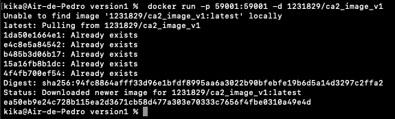

Now you can run the client in your computer while the server is running in the Docker container. To do it, use the commands as before.

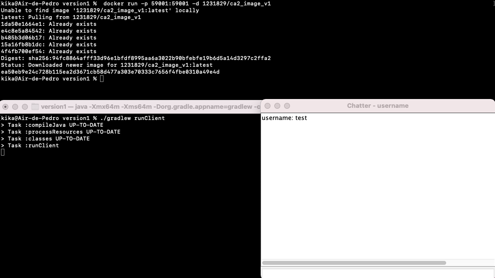
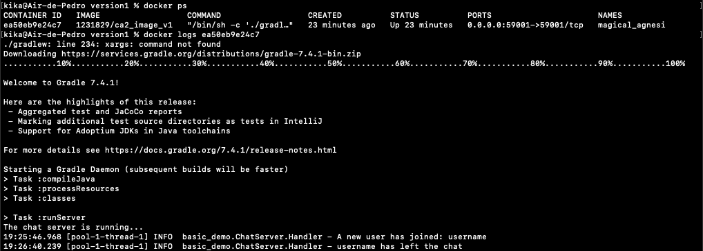

## 2.Version 2

### 2.1. You should create a docker image (i.e., by using a Dockerfile) to execute the chat server

To adapt to the version 2, you'll use the base you already have from version 1.
Go to the directory CA4 Part 1 directory with the command below:

```
cd /Users/kika/Desktop/Switch/segundoSemestre/devOps/praticas/gitRepositorio/CA4/Part1
```

Now you need to create version 2 directory. To do it, use the following command:

```
mkdir version2
```

Copy all content from version1 to version2 directory with the command:

```
cp -r version1/* version2
```

Go to your version2 directory, using the command below:

```
cd version2
```

Open the dockerfile in a text editor and update it as below:

```dockerfile
# syntax=docker/dockerfile:1
FROM openjdk:23-slim
COPY ./build/libs /app
WORKDIR /app
CMD java -cp basic_demo-0.1.0.jar basic_demo.ChatServerApp 59001
```

Explaining all the commands step by step:
FROM - you are now using a java 23 as base image.
COPY - After building the java app mannually in your pc, when creating the image, the DockerFile will copy the generated .jar file to /app directory in the container.
WORKDIR - Change the working location inside the container to this directory. From here onwards all commands will be executed within this directory.
CMD - The command used to execute the webapp in chat server mode.

Before generating the docker image, you must build the java app manually in your pc.
To do that, run the following command:

```
./gradlew jar
```

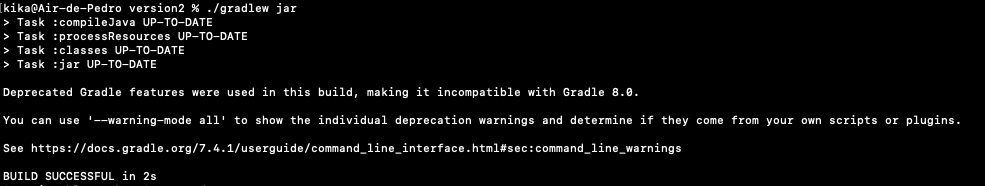

You can now build and tag your docker image with the following command:

```
docker build -t 1231829/ca2_image_v2 .
```

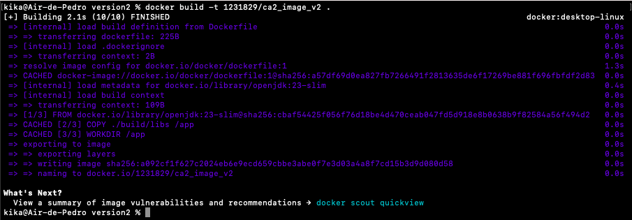

Send the image to docker hub using push command:

```
docker push 1231829/ca2_image_v2
```

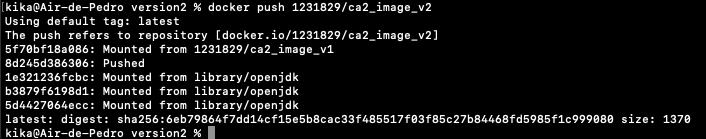

To run the image that is published to docker hub, you can run the following command:

```
docker run -p 59001:59001 -d 1231829/ca2_image_v2
```

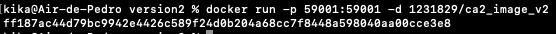

Now you can run the client in your computer while the server is running in the Docker container. To do it, use the commands as before.


