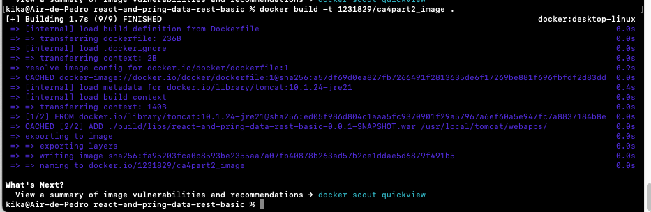
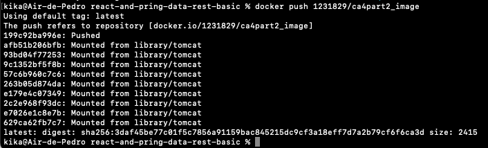
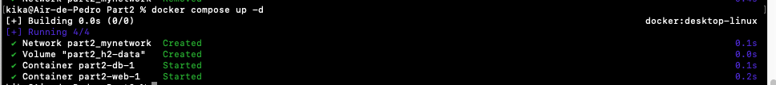
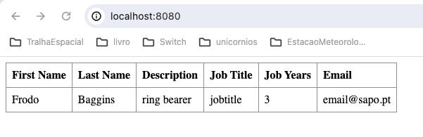
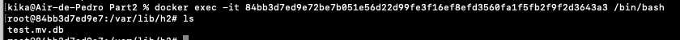
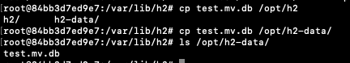

# CA4-Part2

This tutorial will have the following structure:

1. [Use Docker to set up a containerized environment to execute your version of the gradle version of the spring basic tutorial application](#1-use-docker-to-setup-a-containerized-environment-to-execute-your-version-of-the-gradle-version-of-the-spring-basic-tutorial-application)
2. [Alternative](#2-alternative---kubernetes)
3. [Bibliography](#3-bibliography)


## 1. Use Docker to setup a containerized environment to execute your version of the gradle version of the spring basic tutorial application

Go to your directory, with the following command:

```
cd /Users/kika/Desktop/Switch/segundoSemestre/devOps/praticas/gitRepositorio/CA4
```

Create a new package called Part2 with the command below:

```
mkdir Part2
```

You need to copy your project from CA2 Part2 to CA4 Part2. To do it, use the command:

```
cp -r ../../CA2/Part2/react-and-pring-data-rest-basic .
```

Now, you have to configure your application's startup class in order to load the necessary data into an executable .war.
To do this, modify the file to look like this:

```java
package com.greglturnquist.payroll;

import org.springframework.boot.SpringApplication;
import org.springframework.boot.autoconfigure.SpringBootApplication;
import org.springframework.boot.builder.SpringApplicationBuilder;
import org.springframework.boot.web.servlet.support.SpringBootServletInitializer;

@SpringBootApplication
public  class  ReactAndSpringDataRestApplication  extends  SpringBootServletInitializer {

public  static  void  main(String[] args) {
	SpringApplication.run(ReactAndSpringDataRestApplication.class, args);
	}

	@Override
		protected  SpringApplicationBuilder  configure(SpringApplicationBuilder  builder) {
			return  builder.sources(ReactAndSpringDataRestApplication.class);
		}
}
```

Go to your project folder to change the files necessary to run the application in tomcat and connect to an external database server.
To do it, configure the application to connect to the database server of the "db" container, adding the following lines to application.properties

```java
spring.data.rest.base-path=/api

spring.datasource.url=jdbc:h2:tcp://db/test
spring.datasource.username=sa
spring.datasource.password=
spring.datasource.driver-class-name=org.h2.Driver
```

You also need to change the build.gradle file to generate a .war file instead of a .jar .
To add the "id 'war'" configuration to the plugins section, do like this:

```groovy
plugins {
	id 'java'
	id 'org.springframework.boot' version '3.2.4'
	id 'io.spring.dependency-management' version '1.1.4'
	id("org.siouan.frontend-jdk17") version "8.0.0"
	id 'war'
}
```

Now save the file.
In the terminal, in that same directory you can run the command `./gradlew build` and verify that the .war file is generated correctly.

Now you need to create a tomcat-based Dockerfile for your application. To do this, create the file with the following command:

```
touch Dockerfile
```

Open a text editor and save the follow content inside:

```dockerfile
# syntax=docker/dockerfile:1

FROM tomcat:10.1.24-jre21
ADD ./build/libs/react-and-pring-data-rest-basic-0.0.1-SNAPSHOT.war /usr/local/tomcat/webapps/ROOT.war
EXPOSE 8080
CMD ["catalina.sh", "run"]
```

This will allow to generate a docker image, which uses tomcat as a base.
At this point you need to copie the generated .war file to the location from which webapps are run in tomcat.
Note that in this same command the file is renamed to ROOT.war (so that it can be opened at the tomcat root url - http://localhost:8080). Tomcat is exposed on port 8080 and runs catalina.sh, used to run tomcat.

Now you can build and tag the docker image. To do it, use the command below:

```
docker build -t 1231829/ca4part2_image .
```



To send the tag generated from the spring application to Docker Hub use the docker push command, as follows:

```
docker push 1231829/ca4part2_image
```



(I did not push the DB image because it is an existing image, not generated by me.)

To create a docker compose file, use the following command:

```
touch docker-compose.yml
```

After creating the docker compose file, open it in the text editor and place the following content inside:

```yaml
version: '3.7'
services:
	web:
		image: 1231829/ca4part2_image
		ports:
			- "8080:8080"
		networks:
			- mynetwork
		depends_on:
			- db
	db:
		image: jesperdj/h2
		ports:
			- "8082:8082"
			- "9092:9092"
		networks:
			- mynetwork
		volumes:
			- h2-data:/opt/h2-data

networks:
	mynetwork:
	
volumes:
	h2-data:
```

In this docker compose two containers are configured, the "web" - the webapp running on tomcat, and the "db" - database container.

A private docker network "mynetwork" is also created for both to communicate and an h2-data volume where you will make a copy of the database.

To run the containers and verify that is all correctly working, run the command:

```
docker compose up -d
```



You can now verify that the app is working correctly at the url http://localhost:8080/



To run a shell and copy the database file to the volume, run the following command:

```  
docker exec -it <db_container_id> /bin/bash
```



As you can see the test.mv.db database file is located in the /var/lib/h2 directory.
To copy the volume you just need to use `cp test.mv.db /opt/h2-data/`.
If you want to verify that it was copied well, use the command:

```
ls /opt/h2-data/
```



## 2. Alternative - Kubernetes
### Kubernetes

Kubernetes is an open-source container orchestration platform designed to automate the deployment, scaling, and management of containerized applications. It provides a framework to run distributed systems resiliently, taking care of scaling and failover for your application, providing deployment patterns, and more.

### Comparison with Docker

#### Docker:

-   **Containerization:** Docker focuses on packaging applications into containers, providing lightweight and portable encapsulation.
-   **Docker Compose:** Simplifies multi-container Docker applications by defining services, networks, and volumes in a single YAML file.
-   **Single-Node Deployment:** Docker is excellent for local development and single-node deployments.

#### Kubernetes:

-   **Orchestration:** While Docker is great for containerization, Kubernetes excels in orchestrating containers across a cluster of machines.
-   **Scalability:** Kubernetes can automatically scale applications up and down based on demand.
-   **Self-Healing:** Kubernetes ensures that containers that fail are automatically restarted, and those that don’t respond to user-defined health checks are killed and rescheduled.
-   **Load Balancing:** Kubernetes provides built-in load balancing for distributing traffic to multiple containers.
-   **Storage Orchestration:** Kubernetes allows you to mount local storage, cloud storage, and more as persistent volumes.
-   **Declarative Management:** Uses YAML or JSON to manage application deployments, ensuring the desired state of the application is maintained.

### Using Kubernetes to Solve the Same Goals

#### Setup Environment with Kubernetes

To achieve the same setup using Kubernetes, you need to create Kubernetes manifests to define the deployment of your Spring Boot application and H2 database.

#### Step-by-Step Solution

#### 1. Install Kubernetes Tools

First you need to install `kubectl`, the command-line tool for interacting with the Kubernetes cluster.
Then you need to set up a local Kubernetes cluster. To do it you can use Minikube or a managed Kubernetes service like GKE, EKS, or AKS.

#### 2. Create Kubernetes Manifests

To deploy the Spring Boot Application (web):

```yaml
apiVersion: apps/v1
kind: Deployment
metadata:
  name: spring-boot-deployment
spec:
  replicas: 1
  selector:
    matchLabels:
      app: spring-boot
  template:
    metadata:
      labels:
        app: spring-boot
    spec:
      containers:
      - name: spring-boot
        image: 1231829/ca4part2_image
        ports:
        - containerPort: 8080
```


To implement the service for Spring Boot application:

```yaml
apiVersion: v1
kind: Service
metadata:
  name: spring-boot-service
spec:
  selector:
    app: spring-boot
  ports:
  - protocol: TCP
    port: 8080
    targetPort: 8080
  type: LoadBalancer

```    


To deploy the H2 Database (db):

```yaml
apiVersion: apps/v1
kind: Deployment
metadata:
  name: h2-deployment
spec:
  replicas: 1
  selector:
    matchLabels:
      app: h2
  template:
    metadata:
      labels:
        app: h2
    spec:
      containers:
      - name: h2
        image: jesperdj/h2
        ports:
        - containerPort: 8082
        - containerPort: 9092
        volumeMounts:
        - name: h2-data
          mountPath: /opt/h2-data

```


To implement the service for H2 Database:

```yaml
apiVersion: v1
kind: Service
metadata:
  name: h2-service
spec:
  selector:
    app: h2
  ports:
  - protocol: TCP
    port: 8082
    targetPort: 8082
  - protocol: TCP
    port: 9092
    targetPort: 9092

```

Persistent Volume for H2 Database:

```yaml
apiVersion: v1
kind: PersistentVolume
metadata:
  name: h2-pv
spec:
  capacity:
    storage: 1Gi
  accessModes:
    - ReadWriteOnce
  hostPath:
    path: "/mnt/data"

```

Persistent Volume Claim for H2 Database:

```yaml
apiVersion: v1
kind: PersistentVolumeClaim
metadata:
  name: h2-pvc
spec:
  accessModes:
    - ReadWriteOnce
  resources:
    requests:
      storage: 1Gi

```       
#### 3. Deploy to Kubernetes

To apply the manifests using `kubectl` use the following commands:

```
kubectl apply -f spring-boot-deployment.yaml
kubectl apply -f spring-boot-service.yaml
kubectl apply -f h2-deployment.yaml
kubectl apply -f h2-service.yaml
kubectl apply -f h2-pv.yaml
kubectl apply -f h2-pvc.yaml
```        

#### 4. Access the Application

You should use `kubectl get services` to find the external IP address of the `spring-boot-service`.
To access your application use `http://<external-ip>:8080`.

### Conclusion

Using Kubernetes, you can achieve a more robust and scalable solution for deploying containerized applications. Kubernetes provides powerful orchestration features that complement Docker's containerization capabilities, making it suitable for managing complex, multi-container deployments in production environments.

## 3. Bibliography

- https://kubernetes.io/
- https://www.docker.com/
- https://learn.g2.com/kubernetes-vs-docker
- https://contabo.com/blog/docker-vs-kubernetes-a-comparison/

