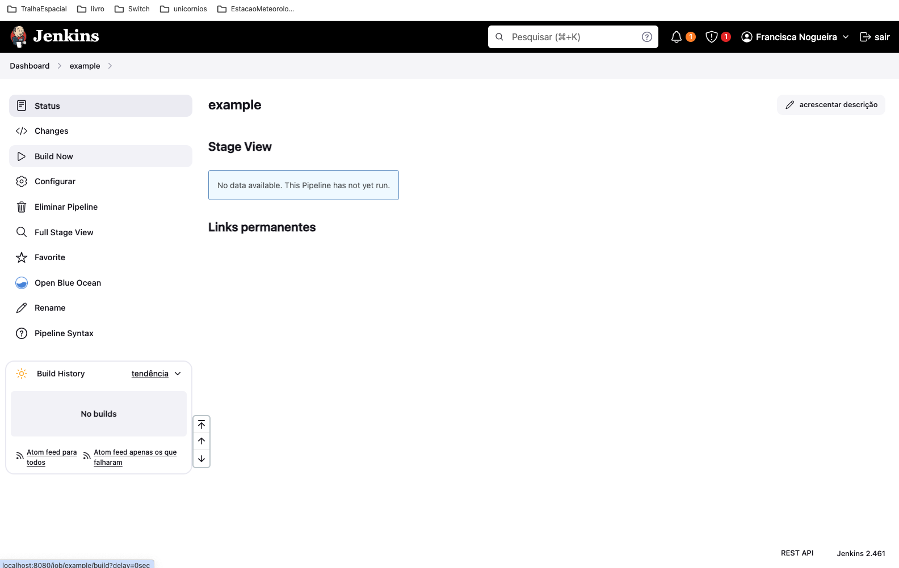
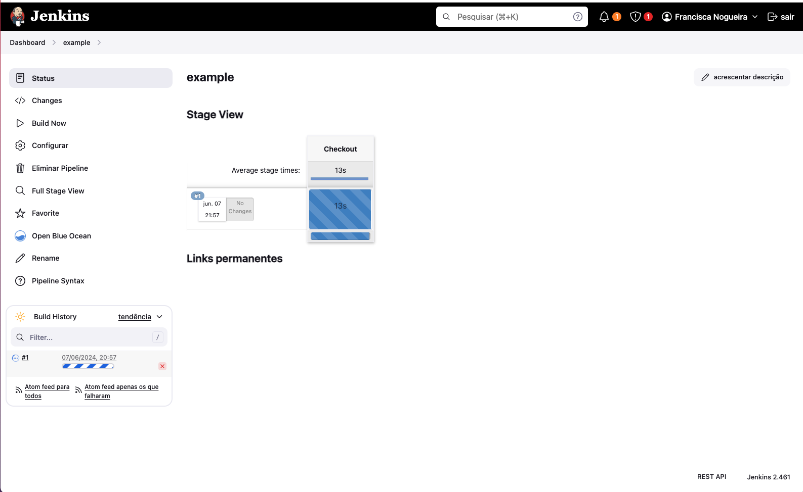
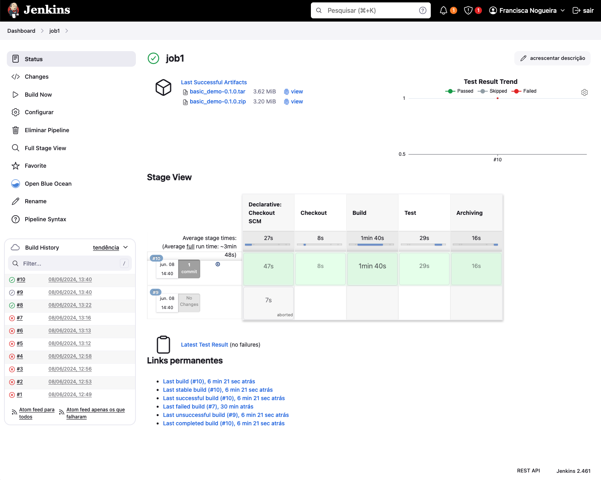

# CA5

This tutorial will have the following structure:

1. [Create a very simple pipeline application](#1-create-a-very-simple-pipeline-application)
2. [Add the `Test` stage in your pipeline](#2-add-the-test-stage-in-your-pipeline)
3. [Create a pipeline in Jenkins to build the tutorial spring boot application](#3-create-a-pipeline-in-jenkins-to-build-the-tutorial-spring-boot-application)

## 1. Create a very simple pipeline application

Copy CA2Part1 folder inside a new folder CA5.
To execute the Docker image of Jenkins, use the command below:

```bash
docker  run  -u  root  --rm  -d  -p  8080:8080  -p  50000:50000  -v  $HOME/jenkins:/var/jenkins_home  -v  /var/run/docker.sock:/var/run/docker.sock  jenkins/jenkins:jdk17
```

After execute the previous command, open your browser with  `http://localhost:8080` to access Jenkins and execute any necessary additional setup step.
Now you can create a new job. To do that follow the steps in the next images:


You should now see the configuration page of the Job.
Scroll to the ”Pipeline” section were you will enter our pipeline script.
In the pipeline edit box enter the script below, as you can see in the next image.

```groovy
pipeline {
	agent any

	stages {
		stage('Checkout') {
			steps {
				echo 'Checking out...'
				git 'https://bitbucket.org/pssmatos/gradle_basic_demo'
			}
		}
		stage('Build') {
			steps {
				echo 'Building...'
				sh './gradlew clean build'
			}		
		}
		stage('Archiving') {
			steps {
				echo 'Archiving...'
				archiveArtifacts 'build/distributions/*'
			}
		}
	}
}

```


After saving your script you will see the following page, where you can press the "Build Now" button to run the Job.



As you can see, Jenkins is running in a pipeline.



You can select the ”build number” of the Job to get details on the execution


The ”Console Output” is usually a good place to see what happened...
You also see that two files are archived during the final stage of the pipeline

Now create into your repository a `Jenkinsfile` file and commit it to your repository.
Because you now want Jenkins to use your new private repository you need to tell Jenkins what credentials to use when accessing our repository.

In Jenkins, go to ”Credentials” and create new credentials with the username and password as in the example:


Now put into your `Jenkinsfile` file the following:

```groovy
pipeline {
	agent any

	stages {
		stage('Checkout') {
			steps {
				echo 'Checking out...'
				git branch: 'main', credentialsId: 'FranciscaNogueira-github-credentials' , url:
				'https://github.com/FranciscaNogueira/devops-23-24-JPE-PSM-1231829.git'
			}
		}
		stage('Build') {
			steps {
				dir('CA5/CA2Part1') {
					echo 'Building...'
					sh './gradlew clean build'
				}
			}
		}
		stage('Archiving') {
			steps {
				dir('CA5/CA2Part1') {
					echo 'Archiving...'
					archiveArtifacts 'build/distributions/*'
				}
			}
		}
	}
}
```

Create a new job as explained before.
Then go to the job settings you just created and fill it in as in the example below:


Click on `Build Now` to execute the pipeline
Jenkins will execute the pipeline as specified in the Jenkinsfile inside the repository!


If installing the plug-in, follow the Open Blue Ocean link in Jenkins you get a more appealing UI


## 2. Add the `Test` stage in your pipeline

To run the tests, you will need to add in your `Jenkinsfile`file the following:

```groovy
stage('Test') {
	steps {
		dir('CA5/CA2Part1') {
			echo 'Testing...'
			sh './gradlew test'
			junit 'build/test-results/test/*.xml'
		}
	}
}
```

Now clock on `Build Now`and you will see something as in the following image:



## 3. Create a pipeline in Jenkins to build the tutorial spring boot application

First of all you need to copy CA2Part2 into your CA5 folder.
Then, add to your `build.gradle`the following:

``` groovy
// inside plugins add the following line to generate a .war output
id 'war'

```

``` groovy
// Define the main class for the application

description = "React and Spring Data REST Basic Example"
springBoot {
	mainClass = 'com.greglturnquist.payroll.ReactAndSpringDataRestApplication'
}

jar {
	duplicatesStrategy = DuplicatesStrategy.INCLUDE // allow duplicates

	manifest {
		attributes "Main-Class": "com.greglturnquist.payroll.ReactAndSpringDataRestApplication"
	}

	from {
		configurations.runtimeClasspath.collect { it.isDirectory() ? it : zipTree(it) }
	}
}

javadoc {
	source = sourceSets.main.allJava
	destinationDir = file('build/docs/javadoc')
}
```

Create a `Jenkinsfile`file as in the example below:

```groovy
pipeline {
	agent any
	
	stages {
		stage('Checkout') {
			steps {
				echo 'Checking out...'
				git branch: 'main', credentialsId: 'FranciscaNogueira-github-credentials' , url:
				'https://github.com/FranciscaNogueira/devops-23-24-JPE-PSM-1231829.git'
			}
		}
		stage('Build') {
			steps {
				dir('CA5/CA2Part2') {
					echo 'Building...'
					sh './gradlew clean build'
				}
			}
		}
		stage('Test') {
			steps {
				dir('CA5/CA2Part2') {
					echo 'Testing...'
					sh './gradlew test'
					junit 'build/test-results/test/*.xml'
				}
			}
		}
		stage('Javadoc') {
			steps {
				dir('CA5/CA2Part2') {
					echo 'Generating Javadoc...'
					sh './gradlew javadoc'
				}
				publishHTML (target: [
					allowMissing: false,
					alwaysLinkToLastBuild: false,
					keepAll: true,
					reportDir: 'CA5/CA2Part2/build/docs/javadoc',
					reportFiles: 'index.html',
					reportName: "Javadoc"
				])
			}
		}
		stage('Archiving') {
			steps {
				dir('CA5/CA2Part2') {
					echo 'Archiving...'
					archiveArtifacts 'build/libs/*'
				}
			}
		}
		stage ('Generate and publish Docker Image') {
			steps {
				script {
					def dockerImage = docker.build("1231829/react-and-pring-data-rest-basic:${env.BUILD_ID}")
					dockerImage.push('latest')
				}
			}
		}
	}
}
```

Commit everything.
Now create a new job in `Jenkins`


Then click on `Build Now`.
As you can see, the entire pipeline will run and it will fail in Docker, as shown in the image below:


To be able to see if the remaining steps of the pipeline are going through correctly, let's now remove the part of generating and publishing the docker image.
To do that, remove the stage ´Generate and publish Docker Image´ from `Jenkinsfile`and commit it. Run the pipeline again.
You can see that the pipeline now ran flawlessly.


The artifacts and test results already appear on the job page and the javadoc is already available in the side menu, as shown in the screenshots below.


Let's now move on to solving the problem in generating and publishing the docker image.
Re-adds the previously removed step.

To be able to create a Docker image within a pipeline, when using a Jenkins that runs on Docker, it is necessary to provide another container that can run Docker, since the Jenkins container does not have Docker installed.
To do that, do the following:

In the terminal, create a network in Docker so that both containers can communicate:

`docker network create jenkins`


In order to execute Docker commands inside Jenkins nodes, download and run the docker:dind Docker image using the following docker run command:

```bash
docker run \
--name jenkins-docker \
--rm \
--detach \
--privileged \
--network jenkins \
--network-alias docker \
--env DOCKER_TLS_CERTDIR=/certs \
--volume jenkins-docker-certs:/certs/client \
--volume jenkins-data:/var/jenkins_home \
--publish 2376:2376 \
docker:dind \
--storage-driver overlay2
```

Now you need to create a custom docker image to `Jenkins`. To do that, start by creating a `Dockerfile`as in the example below:

```dockerfile
FROM jenkins/jenkins:jdk17
USER root
RUN apt-get update && apt-get install -y lsb-release
RUN curl -fsSLo /usr/share/keyrings/docker-archive-keyring.asc \
https://download.docker.com/linux/debian/gpg
RUN echo "deb [arch=$(dpkg --print-architecture) \
signed-by=/usr/share/keyrings/docker-archive-keyring.asc] \
https://download.docker.com/linux/debian \
$(lsb_release -cs) stable" > /etc/apt/sources.list.d/docker.list
RUN apt-get update && apt-get install -y docker-ce-cli
USER jenkins
RUN jenkins-plugin-cli --plugins "blueocean docker-workflow"
```

Create a new docker image by the created Dockerfile. To do that, use the following command:

`docker build -t myjenkins-blueocean:jdk17 .`


Now stop the `Jenkis`docker container that is running. To do that, run the command `docker ps` to copy the  docker container id.


Then, to stop it, run the command `docker stop <id_container>`.
Run the docker image that you created in the previous step with the following command:

```bash
docker  run  --name  jenkins-blueocean  --restart=on-failure  --detach  \
	--network jenkins --env DOCKER_HOST=tcp://docker:2376 \
	--env  DOCKER_CERT_PATH=/certs/client  --env  DOCKER_TLS_VERIFY=1  \
	--publish 8080:8080 --publish 50000:50000 \
	--volume  $HOME/jenkins:/var/jenkins_home  \
	--volume jenkins-docker-certs:/certs/client:ro \
myjenkins-blueocean:jdk17
```

`docker run -u root --rm -d -p 8080:8080 -p 50000:50000 -v $HOME/jenkins:/var/jenkins_home -v /var/run/docker.sock:/var/run/docker.sock jenkins/jenkins:jdk17`

Now you need to add the DockerHub credentials to the Jenkinsfile, to do this update it as follows in the `Generate and publish Docker Image` stage within `steps`:

```groovy
dir('CA5/CA2Part2') {
					script {
						withDockerRegistry([credentialsId: 'docker-hub-credentials']) {
							def dockerImage = docker.build("1231829/react-and-pring-data-rest-basic:${env.BUILD_ID}")
							dockerImage.push('latest')
						}
					}
				}
```

Commit this change and go to the Jenkins page and add the credentials for DockerHub as shown in the image below:


As you can see, if you press the "Build Now" button, the pipeline should already run successfully.


Now let's create a `docker-compose.yml` file so you don't have to remember or save the command manually.
With docker compose you will have a file with all the configurations made to run the containers.  
To do this, first you need to stop all running containers with the command `docker stop $(docker ps -q)`.

Create a `docker-compose.yml`file with the following content:

```yaml
version: '3.8'

networks:
	jenkins:
		driver: bridge
		
volumes:
	jenkins-docker-certs:
	jenkins-data:

services:
	docker:
		image: docker:dind
		privileged: true
		networks:
			jenkins:
				aliases:
					- docker
		environment:
			DOCKER_TLS_CERTDIR: /certs
		volumes:
			- jenkins-docker-certs:/certs/client
			- jenkins-data:/var/jenkins_home
		ports:
			- 2376:2376
		command: --storage-driver overlay2

	jenkins:
		image: myjenkins-blueocean:jdk17
		restart: on-failure
		networks:
			jenkins:
		environment:
			DOCKER_HOST: tcp://docker:2376
			DOCKER_CERT_PATH: /certs/client
			DOCKER_TLS_VERIFY: '1'
		ports:
			- 8080:8080
			- 50000:50000
		volumes:
			- $HOME/jenkins:/var/jenkins_home
			- jenkins-docker-certs:/certs/client:ro
```

Now just run the `docker compose up -d` command in the directory where the file is located and the containers will be automatically executed.


[Back to the top](#ca5)

